# 🧩 A Node-Based Workflow Builder

A simple node-based workflow builder where users can connect different task nodes and edges as conditions.

Right now it supports 3 distinctive nodes:

- Start - Mark the start task or trigger
- Task - Any intermediate task
- End - End task

The codebase uses a registry pattern with configurable nodes, so we can create different specialized nodes based on the use case.

## ⚙️ Setup

You need a minimum Node.js version of 22.13.0 for development and build.

### 🚀 Step-by-Step Local Setup

1. **Clone the repository** 📥

```bash
git clone <your-repository-url>
```

2. **Move into project root** 📂

```bash
cd visual-worflow-builder-react
```

3. **Use the required Node.js version** 🧩

```bash
nvm install 22.13.0
nvm use 22.13.0
node -v
```

4. **Install dependencies** 📦

```bash
npm install
```

5. **Run development server** ▶️

```bash
npm run dev
```

6. **Create production build** 🏗️

```bash
npm run build
```

7. **Preview production build locally** 👀

```bash
npm run preview
```

### 🛠️ Development and Build Environment:

Node Environment Required: 22.13.0

### 🧰 Frontend Tooling

- Vite

### 📚 Library

| Library / Tool | Why this choice | Trade-off to keep in mind |
| --- | --- | --- |
| ReactJS | Component composition makes the node-canvas UI easy to break into isolated, reusable building blocks (`Palette`, `Canvas`, `Config`, `Viewer`). | Large interactive trees can re-render often if memoization boundaries are not designed carefully. |
| React Flow | Provides production-ready node/edge graph rendering, drag-and-drop interactions, zoom/pan controls, and connection lifecycle APIs that drive the core workflow canvas behavior. | Strong library conventions mean custom behavior should be designed around its extension points to avoid brittle overrides. |
| Redux + Redux Toolkit | Predictable centralized state for cross-screen concerns (selection, modal, toast, workflow status) with less boilerplate via slices and typed actions. | Adds indirection compared to local state, so state boundaries must stay intentional. |
| NPM | Native Node ecosystem support with straightforward scripts for local dev, build, and preview. | Lockfile discipline is required to keep team environments deterministic. |
| Tailwind CSS | Fast utility-first styling helps iterate on canvas-heavy UI without context switching between component and stylesheet files. | Utility classes can become noisy if design tokens and composition conventions are not enforced. |
| shadcn | Copy-as-code component primitives provide full control over styling and behavior, useful for product-specific workflow UI customization. | Component ownership shifts to this repo, so upgrades are manual instead of package-driven. |
| Zod | Runtime schema validation protects workflow import/export boundaries and keeps JSON contracts explicit and type-safe. | Schemas need ongoing maintenance as domain models evolve. |

Other dependencies are provided in the `package.json` file.

---

## 🏗️ High Level Architecture

## Design Pattern Choices

1. **Node and Edge interface design**
   - **Node**
     - Generic node interface that can be further specialized.
     - Tracks whether a node is configured or not.
     - Defines input and output port definitions.
     - Stores basic UI-level details.
   - **Edge**
     - Generic base edge interface that can be further specialized.

2. **Edge and Node Registry**
   - Acts as a central state where all nodes can be created and used consistently.

3. **Component design**
   - Components use composition with separation of concerns to increase reusability.

4. **Custom Hooks**
   - Business logic is moved into hooks so only targeted parts need to change.

5. **Performance optimization**
   - Controlled reactivity using debouncing.
   - Controlled rendering of `ConfigurationPanel`.
   - Code splitting with lazy-loaded feature modules to reduce initial bundle load.

6. **Centralized constants**
   - Values come from constants, making updates easy.
   - This also enables future language-specific extensions.

7. **JSON import validation**
   - Built-in validation checks incoming data shape.
   - Can be extended later for checksum-based verification.

8. **UI quality**
   - Clean modern UI with context-based interaction.

A simple high-level presentation view of how layers collaborate across UI rendering, state ownership, and workflow domain transforms.

```mermaid
flowchart TB
    subgraph entryLayer [EntryAndLayoutLayer]
        appRouter[router.tsx]
        workflowScreen[WorkflowScreen]
        appRouter --> workflowScreen
    end

    subgraph uiLayer [UiCompositionLayer]
        workflowHeader[WorkFlowHeader]
        nodePalette[NodePalette]
        canvasContainer[CanvasContainer]
        configurationPanel[ConfigurationPanel]
        workflowViewer[WorkflowViewer]
        validationViewer[WorkFlowValidation]
        jsonViewer[WorkFlowJsonViewer]
        modalHost[GlobalModalHost]
        toastHost[GlobalToastHost]
    end

    subgraph hookLayer [InteractionHooksLayer]
        canvasSelectionHook[useCanvasSelection]
        canvasDragHook[useCanvasDrag]
        canvasConnectHook[useCanvasConnect]
        workflowValidationHook[useWorkflowValidation]
        canvasEventBus[canvasEventBus]
    end

    subgraph stateLayer [StateOwnershipLayer]
        reactFlowState[ReactFlowStateNodesEdges]
        canvasSliceState[ReduxCanvasSliceSelectionValidation]
        globalUiSliceState[ReduxGlobalUiSliceModalToast]
    end

    subgraph domainLayer [WorkflowDomainLayer]
        registry[NodeRegistryTemplates]
        mapper[WorkflowFlowMapper]
        parser[ParseWorkflowJson]
    end

    subgraph sharedLayer [SharedUtilitiesLayer]
        validator[computeWorkflowStateAndMessage]
    end

    workflowScreen --> workflowHeader
    workflowScreen --> nodePalette
    workflowScreen --> canvasContainer
    workflowScreen --> configurationPanel
    workflowScreen --> workflowViewer
    workflowScreen --> modalHost
    workflowScreen --> toastHost

    canvasContainer --> canvasSelectionHook
    canvasContainer --> canvasDragHook
    canvasContainer --> canvasConnectHook
    canvasContainer --> workflowValidationHook
    canvasContainer --> canvasEventBus

    canvasContainer -->|"owns graph state"| reactFlowState
    canvasSelectionHook -->|"dispatch selection updates"| canvasSliceState
    workflowValidationHook -->|"dispatch workflow validation"| canvasSliceState
    canvasSelectionHook <-->|"emit and subscribe"| canvasEventBus
    canvasDragHook <-->|"emit and subscribe"| canvasEventBus
    canvasConnectHook <-->|"emit and subscribe"| canvasEventBus

    configurationPanel -->|"reads selection"| canvasSliceState
    validationViewer -->|"reads workflow status"| canvasSliceState
    jsonViewer -->|"reads graph snapshot"| reactFlowState

    workflowHeader -->|"dispatch modal and toast actions"| globalUiSliceState
    modalHost -->|"reads active modal"| globalUiSliceState
    toastHost -->|"reads toast event"| globalUiSliceState

    nodePalette -->|"creates nodes via drag flow"| canvasDragHook
    canvasDragHook -->|"uses node templates"| registry

    workflowHeader -->|"export maps flow to payload"| mapper
    workflowHeader -->|"import parses payload"| parser
    workflowHeader -->|"import maps payload to flow"| mapper
    mapper --> reactFlowState
    workflowValidationHook -->|"computes validation state"| validator
```



### 🗺️ Legend

- `Layer` 🧱: grouped responsibility boundary (`subgraph`).
- `owns graph state` 🗂️: ReactFlow local nodes and edges are the canvas source of truth.
- `dispatch ... updates` ⚡: writes into Redux state.
- `reads ...` 👀: selector based consumption from Redux or ReactFlow state.
- `emit and subscribe` 📡: canvas hooks coordinate through a shared event bus.
- `maps / parses` 🔄: domain transformation between graph state and portable workflow JSON payload.
- `computes validation state` ✅: shared utility derives workflow validity from current graph.

### 👣 Quick Read Path

1. User interacts with `NodePalette` or `CanvasContainer` 🎯
2. Hooks process intent and update `ReactFlowState` or Redux ⚙️
3. UI panels (`ConfigurationPanel`, `WorkFlowValidation`, `WorkFlowJsonViewer`) render derived state 🪟
4. `WorkFlowHeader` drives import and export through parser and mapper 🔁
5. Global feedback (`GlobalModalHost`, `GlobalToastHost`) is centralized via global UI slice 📣

## 📁 Folder Structure

High Level folder structure

```text
visual-worflow-builder-react/
├─ src/
│  ├─ entry/
│  │  ├─ App.tsx
│  │  └─ router.tsx
│  ├─ presentation/
│  │  ├─ components/
│  │  │  ├─ edges/
│  │  │  ├─ modals/
│  │  │  ├─ nodes/
│  │  │  │  ├─ canvas/
│  │  │  │  ├─ configuration/
│  │  │  │  │  └─ primitives/
│  │  │  │  └─ palette/
│  │  │  ├─ toast/
│  │  │  ├─ ConfigurationPanel.tsx
│  │  │  ├─ NodePalette.tsx
│  │  │  ├─ WorkFlowHeader.tsx
│  │  │  ├─ WorkFlowJsonViewer.tsx
│  │  │  ├─ WorkFlowValidation.tsx
│  │  │  └─ WorkflowViewer.tsx
│  │  └─ screens/
│  │     ├─ DesignSystemScreen.tsx
│  │     ├─ UITestPlaygroundScreen.tsx
│  │     └─ WorkflowScreen.tsx
│  ├─ interaction/
│  │  ├─ canvas/
│  │  │  ├─ events/
│  │  │  ├─ hooks/
│  │  │  └─ CanvasContainer.tsx
│  │  └─ hooks/
│  ├─ state/
│  │  └─ store/
│  ├─ domain/
│  │  ├─ model/
│  │  ├─ registry/
│  │  └─ workflow/
│  │     ├─ constants/
│  │     ├─ io/
│  │     ├─ mapping/
│  │     ├─ parser/
│  │     ├─ schema/
│  │     ├─ serialization/
│  │     └─ index.ts
│  ├─ design-system/
│  │  └─ ui/
│  │     ├─ atoms/
│  │     ├─ components/
│  │     └─ internal/
│  │        └─ animate-ui/
│  │           ├─ components/
│  │           └─ primitives/
│  ├─ shared/
│  │  ├─ constants/
│  │  ├─ lib/
│  │  └─ utils/
│  ├─ modal/
│  ├─ utils/
│  ├─ index.css
│  └─ main.tsx
├─ components.json
├─ package.json
└─ readme.md
```

For details context of folder structure move to.

Canonical map (for humans + AI): `docs/folder-and-file-map.md`

## Design of Canvas

### 📡 Canvas Event Bus

A **minimal pub-sub** for canvas UI events. Handlers emit; hooks subscribe and react. No return values.

```
┌─────────────────────────────────────────────────────────────────┐
│  ReactFlow (onDrop, onClick, onConnect, onDelete, …)             │
└────────────────────────────┬────────────────────────────────────┘
                             │ emitCanvasEvent(type, payload)
                             ▼
┌─────────────────────────────────────────────────────────────────┐
│  canvasEventBus (singleton)                                      │
│  emitCanvasEvent() │ subscribeCanvasEvent() → unsubscribe        │
└────────────────────────────┬────────────────────────────────────┘
                             │
         ┌───────────────────┼───────────────────┐
         ▼                   ▼                   ▼
   useCanvasDrag      useCanvasConnect    useCanvasSelection
   setNodes           setEdges           dispatch(selection)
```

### 🎯 Use Case

- **Decouple UI actions** — Drag, mode, delete, input change, connect stay in separate hooks.
- **Single source of truth** — One bus; all canvas events flow through it.
- **Extensible** — Add new event types and subscribers without touching existing hooks.

### 💡 Why It Matters

| Without event bus               | With event bus                                      |
| ------------------------------- | --------------------------------------------------- |
| God component with all handlers | Per-concern hooks (drag, selection, connect)        |
| Tight coupling, hard to test    | Loose coupling, easy to mock `emit`                 |
| Undo/redo = invasive refactor   | Future command pattern can subscribe to same events |
