# 🧩 A Node-Based Workflow Builder

A simple node-based workflow builder where users can connect different task nodes and edges as conditions.

Right now it supports 3 distinctive nodes:

- Start - Mark the start task or trigger
- Task - Any intermediate task
- End - End task

The codebase uses a registry pattern with configurable nodes, so we can create different specialized nodes based on the use case.

## ⚙️ Setup

You need a minimum Node.js version of 22.13.0 for development and build.

### 🛠️ Development and Build Environment:

Node Environment Required: 22.13.0

### 🧰 Frontend Tooling

- Vite

### 📚 Library

- UI Library - ReactJS
- State Management - Redux + Redux Toolkit
- Package Management - NPM
- CSS Utility - Tailwind CSS
- UI Component Management - shadcn
- JSON Validator - Zod

Other dependencies are provided in the `package.json` file.

---

## 🏗️ High Level Architecture

A simple high-level presentation view of how layers collaborate across UI rendering, state ownership, and workflow domain transforms.

```mermaid
flowchart TB
    subgraph entryLayer [EntryAndLayoutLayer]
        appRouter[router.tsx]
        workflowScreen[WorkflowScreen]
        appRouter --> workflowScreen
    end

    subgraph uiLayer [UiCompositionLayer]
        workflowHeader[WorkFlowHeader]
        nodePalette[NodePalette]
        canvasContainer[CanvasContainer]
        configurationPanel[ConfigurationPanel]
        workflowViewer[WorkflowViewer]
        validationViewer[WorkFlowValidation]
        jsonViewer[WorkFlowJsonViewer]
        modalHost[GlobalModalHost]
        toastHost[GlobalToastHost]
    end

    subgraph hookLayer [InteractionHooksLayer]
        canvasSelectionHook[useCanvasSelection]
        canvasDragHook[useCanvasDrag]
        canvasConnectHook[useCanvasConnect]
        workflowValidationHook[useWorkflowValidation]
    end

    subgraph stateLayer [StateOwnershipLayer]
        reactFlowState[ReactFlowStateNodesEdges]
        canvasSliceState[ReduxCanvasSliceSelectionValidation]
        globalUiSliceState[ReduxGlobalUiSliceModalToast]
    end

    subgraph domainLayer [WorkflowDomainLayer]
        registry[NodeRegistryTemplates]
        mapper[WorkflowFlowMapper]
        parser[ParseWorkflowJson]
        validator[WorkflowValidationRules]
    end

    workflowScreen --> workflowHeader
    workflowScreen --> nodePalette
    workflowScreen --> canvasContainer
    workflowScreen --> configurationPanel
    workflowScreen --> workflowViewer
    workflowScreen --> modalHost
    workflowScreen --> toastHost

    canvasContainer --> canvasSelectionHook
    canvasContainer --> canvasDragHook
    canvasContainer --> canvasConnectHook
    canvasContainer --> workflowValidationHook

    canvasContainer -->|"owns graph state"| reactFlowState
    canvasSelectionHook -->|"dispatch selection updates"| canvasSliceState
    workflowValidationHook -->|"dispatch workflow validation"| canvasSliceState

    configurationPanel -->|"reads selection"| canvasSliceState
    validationViewer -->|"reads workflow status"| canvasSliceState
    jsonViewer -->|"reads graph snapshot"| reactFlowState

    workflowHeader -->|"dispatch modal and toast actions"| globalUiSliceState
    modalHost -->|"reads active modal"| globalUiSliceState
    toastHost -->|"reads toast event"| globalUiSliceState

    nodePalette -->|"creates nodes via drag flow"| canvasDragHook
    canvasDragHook -->|"uses node templates"| registry

    workflowHeader -->|"export maps flow to payload"| mapper
    workflowHeader -->|"import parses payload"| parser
    parser --> mapper
    mapper --> reactFlowState
    validator --> workflowValidationHook
```



### 🗺️ Legend

- `Layer` 🧱: grouped responsibility boundary (`subgraph`).
- `owns graph state` 🗂️: ReactFlow local nodes and edges are the canvas source of truth.
- `dispatch ... updates` ⚡: writes into Redux state.
- `reads ...` 👀: selector based consumption from Redux or ReactFlow state.
- `maps / parses` 🔄: domain transformation between graph state and portable workflow JSON payload.

### 👣 Quick Read Path

1. User interacts with `NodePalette` or `CanvasContainer` 🎯
2. Hooks process intent and update `ReactFlowState` or Redux ⚙️
3. UI panels (`ConfigurationPanel`, `WorkFlowValidation`, `WorkFlowJsonViewer`) render derived state 🪟
4. `WorkFlowHeader` drives import and export through parser and mapper 🔁
5. Global feedback (`GlobalModalHost`, `GlobalToastHost`) is centralized via global UI slice 📣

## 📁 Folder Structure

High Level folder structure

```text
visual-worflow-builder-react/
├─ src/
│  ├─ entry/
│  │  ├─ App.tsx
│  │  └─ router.tsx
│  ├─ presentation/
│  │  ├─ components/
│  │  │  ├─ edges/
│  │  │  ├─ modals/
│  │  │  ├─ nodes/
│  │  │  │  ├─ canvas/
│  │  │  │  ├─ configuration/
│  │  │  │  │  └─ primitives/
│  │  │  │  └─ palette/
│  │  │  ├─ toast/
│  │  │  ├─ ConfigurationPanel.tsx
│  │  │  ├─ NodePalette.tsx
│  │  │  ├─ WorkFlowHeader.tsx
│  │  │  ├─ WorkFlowJsonViewer.tsx
│  │  │  ├─ WorkFlowValidation.tsx
│  │  │  └─ WorkflowViewer.tsx
│  │  └─ screens/
│  │     ├─ DesignSystemScreen.tsx
│  │     ├─ UITestPlaygroundScreen.tsx
│  │     └─ WorkflowScreen.tsx
│  ├─ interaction/
│  │  ├─ canvas/
│  │  │  ├─ events/
│  │  │  ├─ hooks/
│  │  │  └─ CanvasContainer.tsx
│  │  └─ hooks/
│  ├─ state/
│  │  └─ store/
│  ├─ domain/
│  │  ├─ model/
│  │  ├─ registry/
│  │  └─ workflow/
│  │     ├─ constants/
│  │     ├─ io/
│  │     ├─ mapping/
│  │     ├─ parser/
│  │     ├─ schema/
│  │     ├─ serialization/
│  │     └─ index.ts
│  ├─ design-system/
│  │  └─ ui/
│  │     ├─ atoms/
│  │     ├─ components/
│  │     └─ internal/
│  │        └─ animate-ui/
│  │           ├─ components/
│  │           └─ primitives/
│  ├─ shared/
│  │  ├─ constants/
│  │  ├─ lib/
│  │  └─ utils/
│  ├─ modal/
│  ├─ utils/
│  ├─ index.css
│  └─ main.tsx
├─ components.json
├─ package.json
└─ readme.md
```

For details context of folder structure move to.

Canonical map (for humans + AI): `docs/folder-and-file-map.md`

## Design Pattern Choises

1. A node and edge interface design
   Node - Generic node interface that have futher specialise - State to check if a node was configured or not - Has ablity to define input and output ports definition - store basic ui level details to -

   Edge - Geric base node interface that can be futher specialise

2. Edge and Node Registry - This acts as a central state where all node can be simple create and will used. -
3. Component design -
   - Compontent are design using composition pattern with seperation of concen to increase reusablity.
4. Custom Hooks - Busines logic are added into hooks so that only parts of code has be changed.

5. Performation optimisation:

- Controlled reactivity using debouncing
- Controlled rendering of Configuration Panel

5. All the values comes from contants so that it easy to be change. Also futher language specific system can be easily built.
6. JSON import has validation inbuild to check if incoming in proper shape. Also it can be easly extended in case checksum base check is needed to be added.
7. Clean modern ui with context based interaction

### 📡 Canvas Event Bus

A **minimal pub-sub** for canvas UI events. Handlers emit; hooks subscribe and react. No return values.

```
┌─────────────────────────────────────────────────────────────────┐
│  ReactFlow (onDrop, onClick, onConnect, onDelete, …)             │
└────────────────────────────┬────────────────────────────────────┘
                             │ emitCanvasEvent(type, payload)
                             ▼
┌─────────────────────────────────────────────────────────────────┐
│  canvasEventBus (singleton)                                      │
│  emitCanvasEvent() │ subscribeCanvasEvent() → unsubscribe        │
└────────────────────────────┬────────────────────────────────────┘
                             │
         ┌───────────────────┼───────────────────┐
         ▼                   ▼                   ▼
   useCanvasDrag      useCanvasConnect    useCanvasSelection
   setNodes           setEdges           dispatch(selection)
```

### 🎯 Use Case

- **Decouple UI actions** — Drag, mode, delete, input change, connect stay in separate hooks.
- **Single source of truth** — One bus; all canvas events flow through it.
- **Extensible** — Add new event types and subscribers without touching existing hooks.

### 💡 Why It Matters

| Without event bus               | With event bus                                      |
| ------------------------------- | --------------------------------------------------- |
| God component with all handlers | Per-concern hooks (drag, selection, connect)        |
| Tight coupling, hard to test    | Loose coupling, easy to mock `emit`                 |
| Undo/redo = invasive refactor   | Future command pattern can subscribe to same events |
